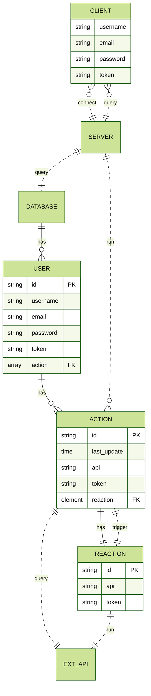

# AREA

Bussiness application connecting services to automate tasks between them.<br>

Developed with React, Express js and MongoDB.
  
# Contributors

- [ClemenceVan](https://github.com/ClemenceVan)
- [jeremiegermond](https://github.com/jeremiegermond)
- [CurtisFL](https://github.com/CurtisFL)
- [Thibb1](https://github.com/Thibb1)

# Usage

It is assumed that the user already has a working [Docker installation][1] on their machine.

You have to add a `.env` to the root of the folder.

Refer to the following example (more can be found in `docker-compose.yml`):

```shell

HTTPS=boolean # default false

SSL_CRT_FILE=path # default none

SSL_CRT_FILE=path # default none

BASE_URL=url # default http://localhost

{SERVICE}_APP_ID=id # default id for localhost only

{SERVICE}_APP_SECRET=id # default secret for localhost only

WEBHOOK_URL=unset # must be set for webhooks to work (explained below)

```

## Building from source

```shell
git clone https://github.com/Thibb1/B-DEV-500-area.git
cd B-DEV-500-area
docker-compose up --build
```

Hit `Ctrl+C` to stop the containers.

Compilation only: `docker-compose build`

### Usage of Webhooks

If you are deploying the app on an http adress such as localhost, using webhooks will require an additional step.

To make sure you will recieve webhooks alerts you need use a command-line application to forward the requests.


The tool used is called [NGROK][4]

1. Go to the [download page][5]

2. Sign up

3. Follow [the instructions][5] to add your token

4. Launch Ngrok on port 8080

```bash
ngrok http 8080
```

5. Then you simply have to paste the *Forwarding* url in the project env on the WEBHOOK_URL key in [docker-compose.yml](https://github.com/Thibb1/B-DEV-500-area/blob/docker/docker-compose.yml  "docker-compose.yml")

## Open the application

- Open your browser and go to [http://localhost:8081][2]

- Download and install the [mobile application][3]

# About the project

## Goal

The goal of this project is to discover, as a whole, the software platform that you have chosen through the creation of a business application. <br>

To do this, we implemented a software suite that functions similar to that of IFTTT and/or Zapier.

This software suite can be broken down into three parts:

- An application server with the following components:
- A REST API
- An authentication system
- A MongoDB database

- Actions:
  - Intranet notification
  - New Tweet mentioning the user

- Reactions:
  - Send an email
  - Set a Microsoft Teams status

- A web client to use the application from your browser by querying the application server
- A mobile client to use the application from your phone by querying the application server

## Architecture

<!--
|o o| Zero or one

|| || Exactly one

}o o{ Zero or more (no upper limit)

}| |{ One or more (no upper limit)

PK primary key

FK foreign key

-->

Here is a diagram of the architecture of the application. <br>



## Technologies Used

To ensure we are the most efficient equally on the client-side and server-side we splitted the project between two main framework assisted by multiples librairies and a no-sql database

### ExpressJS

Used for the back-end of the project ExpressJS is a framework based on nodeJS, it's a web application framework that provides broad features for building web and mobile applications we use it's simple routing for requests made by clients and middleware that is responsible for making decisions to give the correct responses for the requests made by the client

### ReactJS

For the front-end and client side we use React a Javascript framework, we choose React for it's component system ,easy syntax, maintainability and because react is well documented and used by a majority of front-end developpers, it also work very well with the technox used for the server-side (NodeJs/ExpressJs)

### MongoDB

MongoDB is an open source NoSQL database used to store our Actions-Reactions data and our users.
It uses a JSON-like format to store documents in object which makes it really fast and easy to use by deleting the "normalization of the data" process which can take a lot of time in large-scale applications

# Documentation

# Server

The application server is the only one to embed the business logic of the project. It will offer its services to web & mobile clients through a REST API.

## Here are the configured endpoints:

#### User (all User requests except /signup & /login require JWT as Authorization header)


| Description                            | Method | Endpoint                        | Body params (x-www-form-urlencoded)                        | Return                                                                                       |
| -------------------------------------- | ------ | ------------------------------- | ---------------------------------------------------------- | -------------------------------------------------------------------------------------------- |
| Signup user                            | POST   | /signup                         | username, password                                         | 200, message: "Signup successful",<br>token,                                                 |
| Login user                             | POST   | /login                          | username, password                                         | 200, token                                                                                   |
| Logout user                            | GET    | /logout                         |                                                            | 200, "Goodbye!"                                                                              |
| Get actions from user's services       | GET    | /user/getActions                |                                                            | 200, JSON with list of actions available                                                     |
| Get reactions from user's services     | GET    | /user/getReactions              |                                                            | 200, JSON with list of reactions available                                                   |
| Get user's registered action/reactions | GET    | /user/getActionReaction         |                                                            | 200, JSON with list of user reactions/reactions                                              |
| Unlink action/reaction from user       | DELETE | /user/deleteActionReaction/{id} |                                                            | 200, "ar deleted"                                                                            |
| Create actionReaction table for user   | POST   | /user/addActionReaction         | action\_id, reaction\_id, action\_params, reaction\_params | 201, "action {actionName} and reaction {reactionName} successfully added to user {username}" |
| Remove API from user's linked APIs     | DELETE | /user/deleteAPI/{api}           |                                                            | 200, "Api deleted"                                                                           |
| Get API status from user's linked APIs | GET    | /user/hasApi/{api}              |                                                            | 200, boolean                                                                                 |
  

#### Services, Actions, Reactions
| Add new service                     | POST   | /addService                          | name, desc, appKeys                                                                    | 201 "Service saved successfully!"                        |
| ----------------------------------- | ------ | ------------------------------------ | -------------------------------------------------------------------------------------- | -------------------------------------------------------- |
| Add new API action to service       | POST   | /addAction                           | service, name, desc, method, options,<br>endpointUrl, header, body, trigger, userKey   | 201, "Action added successfully to service {service}!"   |
| Add new Webhook action to service   | POST   | /addAction                           | service, name, desc, method, options,<br>target\_type, webhook\_type, condition\_value | 201, "Action added successfully to service {service}!"   |
| Add new reaction to service         | POST   | /addReaction                         | service, name, desc, method, options,<br>endpointUrl, header, body, userKey            | 201, "Reaction added successfully to service {service}!" |
| Remove service                      | DELETE | /removeService/{service}             |                                                                                        | 201; "{service} was removed."                            |
| Remove action from service          | DELETE | /removeAction/{service}/{action}     |                                                                                        | 201; "{action} was removed from {service}."              |
| Remove reaction from service        | DELETE | /removeReaction/{service}/{reaction} |                                                                                        | 201; "{reaction} was removed from {service}."            |
| Get {service} authentification page | GET    | /user/{service}/addAccount           |                                                                                        | 200; JSON with an URL path {path: "google.com"}          |
| Add {service} authentification keys | POST   | /user/{service}/callback             | {service} return parameters                                                            | 201; "{service} key added to {user}"                     |
  

#### Others


| Description                      | Method | Endpoint         | Body params (x-www-form-urlencoded) | Return                                                      |
| -------------------------------- | ------ | ---------------- | ----------------------------------- | ----------------------------------------------------------- |
| Display infos about the server   | GET    | /about.json      |                                     | 200, JSON with list of services, actions & reactions        |
| Check server state               | GET    | /ping2           |                                     | 200; true                                                   |
| Check server state for Github CI | GET    | /                |                                     | 200; "It works"                                             |
| Oauth2 with google               | GET    | /google          |                                     | Redirects to google auth page                               |
| Oauth2 callback                  | GET    | /google/callback |                                     | Redirects to login page with jwt token has search parameter |
  

## Database

The database uses MongoDB to store user's and services' data.

Here is a schema of the tables and their relations :


  
## How does it work?

The server checks every 5 seconds if a user's action has been detected and will trigger the reaction accordingly.
We created a very standard way of handling action and reactions which allows us to create basically any kind of call we may need.

We can configure the endpoint url, header or body with any kind of parameters that will be fetched in user's and service's tables.
For example, the url "https://api.spotify.com/v1/playlists/{ID}" will be replaced by the ID param in User->actionReaction.action_params to create a callable url.
The header "Authorization:access_token" will create an authorization header whose token will be fetch from User->UserKeys->keys and Service->appKeys, with the User having priority.

To check if the action is valid, we gather informations from the request's response and compare it with the previous' answer we got on the last call.
Here are the configured trigger :
Code:
| Trigger name 	| Params             	| Example                   	|
|--------------	|--------------------	|---------------------------	|
| CodeIs       	| str (code)         	| "200"                     	|
| CodeHas      	| str (part of code) 	| "4.."                     	|
| CodeChanged  	| /                  	| prev = "301", new = "200" 	|

Data:
| Trigger name 	| Params               	| Example                                             	|
|--------------	|----------------------	|-----------------------------------------------------	|
| DataIs       	| str (whole data ===) 	|                                                     	|
| DataHas      	| str str (key, val)   	| "name: test" is in data                             	|
| DataChanged  	| str (key)            	| prev had "name: test", new key name is /= or absent 	|
| DataUp       	| str (key)            	| prev was 8, new key name is >8                      	|
| DataDown     	| str (key)            	| prev was 8, new key name is <8                      	|


ie. : `dataChanged,followers.total&&codeIs,200`
will check if the value of res.followers.total in the call response has changed since the previous call AND that the returned http code is "200"
<!-- Links -->

  

[1]:https://docs.docker.com/get-docker/

  

[2]:http://localhost:8081

  

[3]:http://localhost:8081/client.apk

  

[4]:https://ngrok.com

  

[5]:https://ngrok.com/download
